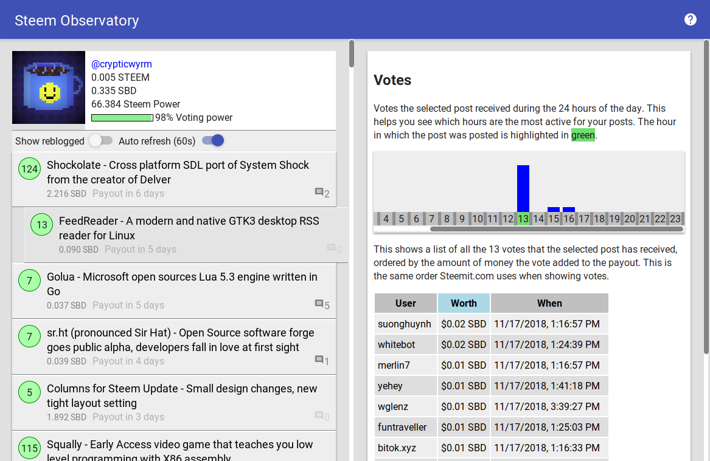

# Steem Observatory

Steem Observatory is a small analytics dashboard for [Steem](https://www.steemit.com) written in [ClojureScript](https://clojurescript.org/) and [Reagent](https://reagent-project.github.io/) that aims to be very easy to use, not just for power users but for the average user of Steem.

You can view the app in Firefox and Chrome based browsers at: https://crypticwyrm.neocities.org/steemobservatory/

You can view it as a big website covering the whole screen and showing data in a split view, or you can make the window very narrow and move it to the side like a sidebar to have it open 24/7 on your screen, giving you a live updating view on the current state of your Steem account. The design is responsive so all you need to do to switch between the two modes is resize the browser window.

Clicking on the username displayed at the top lets you change it to display any Steem user in the app, no need to login with your Steem account since all data used in the app is public.

The big green and red circles in front of Steem posts represent articles that can still generate money (green, less than 7 days old) or not (red, older than 7 days). Clicking on the circle shows you interesting data about the votes, with tables and graphs, like which hour of the day had the most votes or which voters added the highest rewards to your article.

## How to run the code

To build this project you will need to install [the JDK](http://www.oracle.com/technetwork/java/javase/downloads/jdk9-downloads-3848520.html) and the [Boot build tool](http://boot-clj.com/).

To run this app for development, do `boot run`. To compile for production, do `boot build-simple`.

The Nightlight programming environment is started when you run the development server, so if you don't have a favorite Clojure text editor yet, you can just go to http://localhost:4000 in your browser and edit the code there, together with a live REPL, code completion, Parinfer and everything else you'd want from a Clojure development environment, with zero configuration needed. The majority of the code in this project was written using Nightlight.

## Pull requests

Pull requests are welcome, if you make one you agree to license the code as MIT for inclusion in this project.